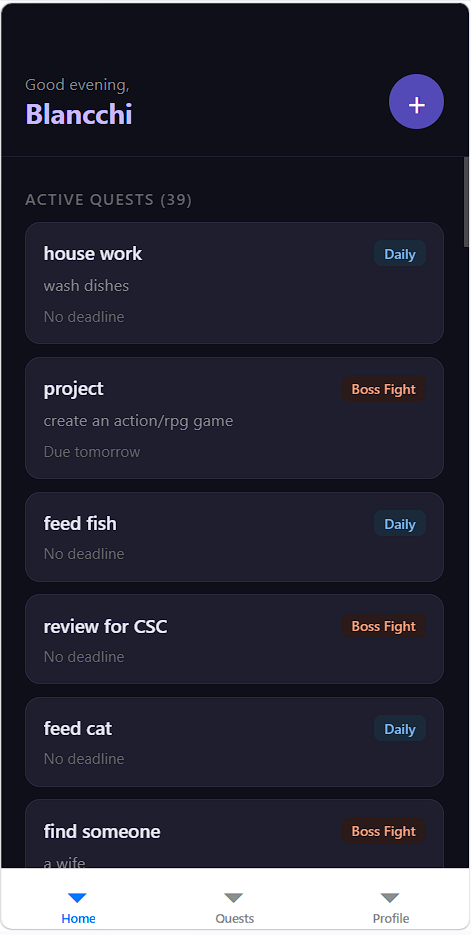
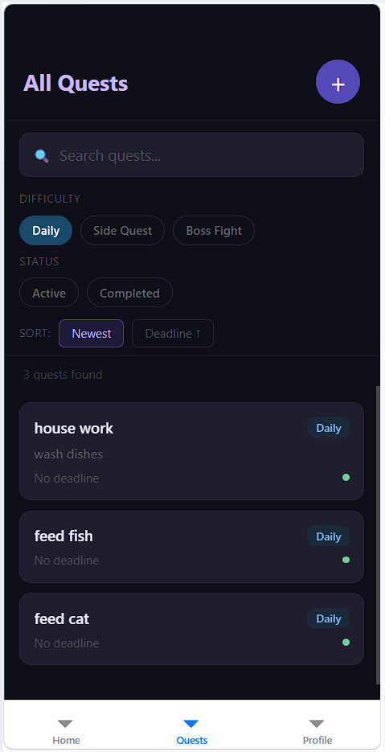
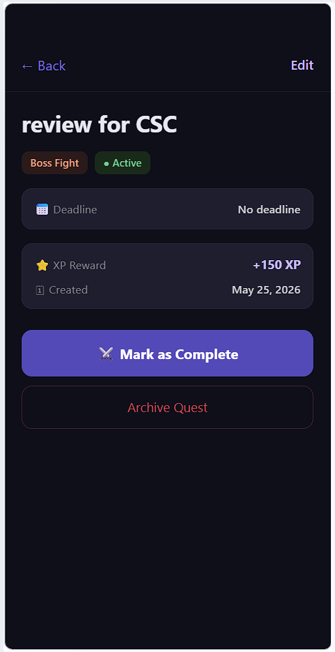
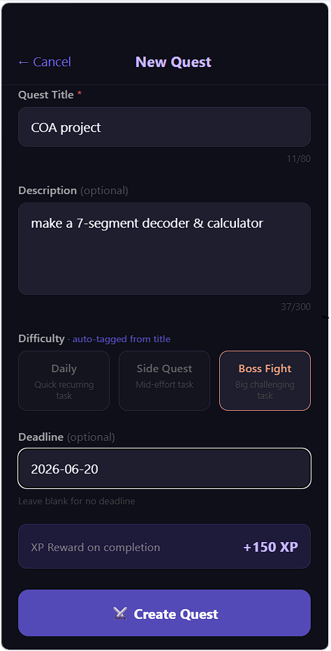
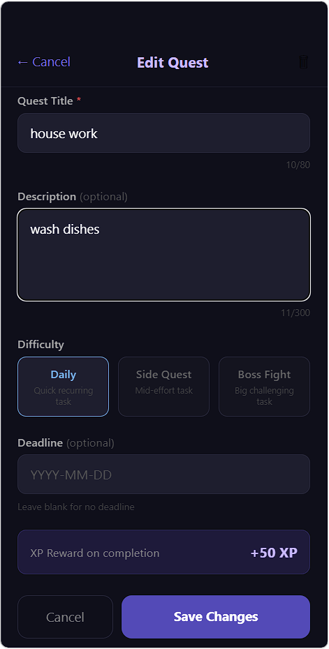
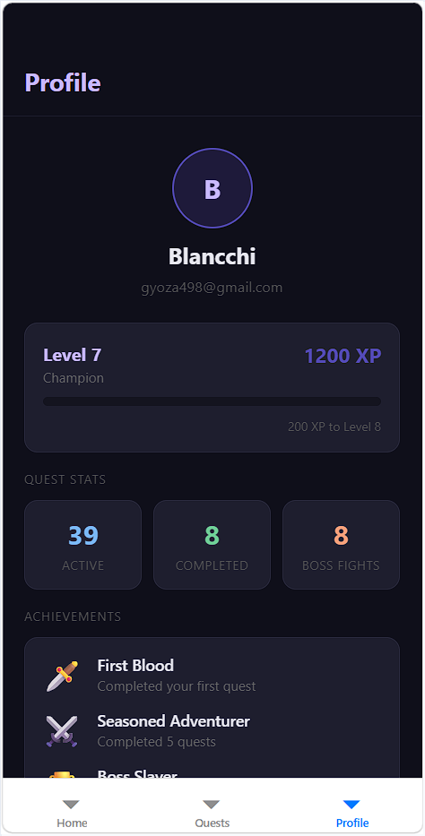

# ⚔️ QuestLog: Productivity for Gamers

A task management app that turns real-life to-do lists into RPG quests. Built with Expo + React Native and Firebase.


## 📱 Screenshots

| Home | Quest List | Quest Detail |
|------|------------|--------------|
|  |  |  |

| Create Quest | Edit Quest | Profile |
|--------------|------------|---------|
|  |  |  ||

---

## 🎮 Features

### Midterm MVP
- 🔐 **Firebase Authentication** — Register, Login, Logout, and Guest (Anonymous) access
- ⚔️ **Quest CRUD** — Create, Read, Update, and soft-delete (Archive) quests
- 🏷️ **Difficulty System** — Daily (+50 XP), Side Quest (+100 XP), Boss Fight (+150 XP)
- 🔍 **Filter, Sort & Search** — Filter by difficulty/status, sort by newest or deadline, live search
- 📈 **XP & Leveling** — Earn XP on quest completion, auto level-up system
- 🏆 **Achievements** — Unlock badges based on quest completion milestones
- 👤 **Guest Mode** — Browse publicly without an account
- 🌙 **Dark RPG Theme** — Full dark mode UI with purple accent colors

### Finals (Planned)
- 🤖 **Smart Categorization** — AI-powered auto-tagging via Claude API
- 🔔 **Push Notifications** — FCM reminders for quest deadlines
- 📷 **Camera** — Avatar upload via device camera
- 🔒 **Security Rules** — Owner-only write access per Firestore rules

---

## 🛠️ Tech Stack

| Technology | Purpose |
|-----------|---------|
| Expo + React Native | Cross-platform mobile framework |
| TypeScript | Type-safe development |
| Firebase Auth | User authentication |
| Cloud Firestore | NoSQL database for quest/user data |
| Firebase Storage | Avatar image uploads (Finals) |
| React Navigation | Stack + Tab navigation |

---

## 📁 Project Structure

```
src/
├── screens/          # All 6 app screens
│   ├── HomeScreen.tsx
│   ├── QuestListScreen.tsx
│   ├── QuestDetailScreen.tsx
│   ├── CreateQuestScreen.tsx
│   ├── EditQuestScreen.tsx
│   ├── ProfileScreen.tsx
│   ├── LoginScreen.tsx
│   └── RegisterScreen.tsx
├── services/         # Firebase service layer
│   ├── firebase.ts
│   ├── authService.ts
│   ├── questService.ts
│   └── userService.ts
├── hooks/            # Custom React hooks
│   ├── useAuth.ts
│   └── useQuests.ts
├── models/           # TypeScript interfaces
│   ├── Quest.ts
│   └── User.ts
├── navigation/       # React Navigation setup
│   └── AppNavigator.tsx
└── utils/            # Helper utilities
    ├── xpCalculator.ts
    ├── tagClassifier.ts
    └── alert.ts
```

---

## 🗄️ Firestore Data Model

### `users` collection
| Field | Type | Description |
|-------|------|-------------|
| uid | string | Firebase Auth UID |
| displayName | string | Adventurer name |
| email | string | User email |
| xp | number | Total XP earned |
| level | number | Current level |
| createdAt | timestamp | Account creation date |

### `quests` collection
| Field | Type | Description |
|-------|------|-------------|
| questId | string | Auto-generated ID |
| uid | string | Owner's UID |
| title | string | Quest name |
| description | string | Quest details |
| status | string | active / completed / failed |
| difficulty | string | daily / side_quest / boss_fight |
| deadline | timestamp | Optional due date |
| isArchived | boolean | Soft delete flag |
| createdAt | timestamp | Creation date |

---

## 🚀 Getting Started

### Prerequisites
- Node.js 18+
- Expo CLI
- Firebase project

### Installation

```bash
# Clone the repository
git clone https://github.com/Blancchi/QuestLog.git
cd QuestLog

# Install dependencies
npm install

# Create environment file
cp .env.example .env
# Fill in your Firebase config values in .env

# Start the development server
npx expo start
```

### Environment Variables

Create a `.env` file in the root directory:

```
EXPO_PUBLIC_FIREBASE_API_KEY=your_api_key
EXPO_PUBLIC_FIREBASE_AUTH_DOMAIN=your_project.firebaseapp.com
EXPO_PUBLIC_FIREBASE_PROJECT_ID=your_project_id
EXPO_PUBLIC_FIREBASE_STORAGE_BUCKET=your_project.firebasestorage.app
EXPO_PUBLIC_FIREBASE_MESSAGING_SENDER_ID=your_sender_id
EXPO_PUBLIC_FIREBASE_APP_ID=your_app_id
```

---

## 🧪 Test Cases

| # | Test Case | Expected Result | Status |
|---|-----------|----------------|--------|
| 1 | Register with valid credentials | Account created, redirected to Home | ✅ |
| 2 | Register with mismatched passwords | Validation error shown | ✅ |
| 3 | Login with correct credentials | Successfully logged in | ✅ |
| 4 | Login with wrong password | Error message shown | ✅ |
| 5 | Continue as Guest | Anonymous access to Home and Quests | ✅ |
| 6 | Create quest with title only | Quest created with auto-tagged difficulty | ✅ |
| 7 | Create quest without title | Validation error "Missing title" | ✅ |
| 8 | Mark quest as complete | XP added to profile, status updated | ✅ |
| 9 | Edit quest title and difficulty | Changes saved to Firestore | ✅ |
| 10 | Archive a quest | Quest hidden from list (soft delete) | ✅ |
| 11 | Filter quests by Daily difficulty | Only Daily quests shown | ✅ |
| 12 | Sort quests by deadline | Quests ordered by nearest deadline | ✅ |
| 13 | Search quest by title keyword | Matching quests shown in real time | ✅ |
| 14 | Guest tries to create quest | Redirected to Login screen | ✅ |
| 15 | Log out | Session cleared, redirected to Login | ✅ |

---

## 👨‍💻 Developer

**Blancchi**
- GitHub: [@Blancchi](https://github.com/Blancchi)

---

## 📄 License

This project is for educational purposes — ADET2 Midterm/Finals Project.
